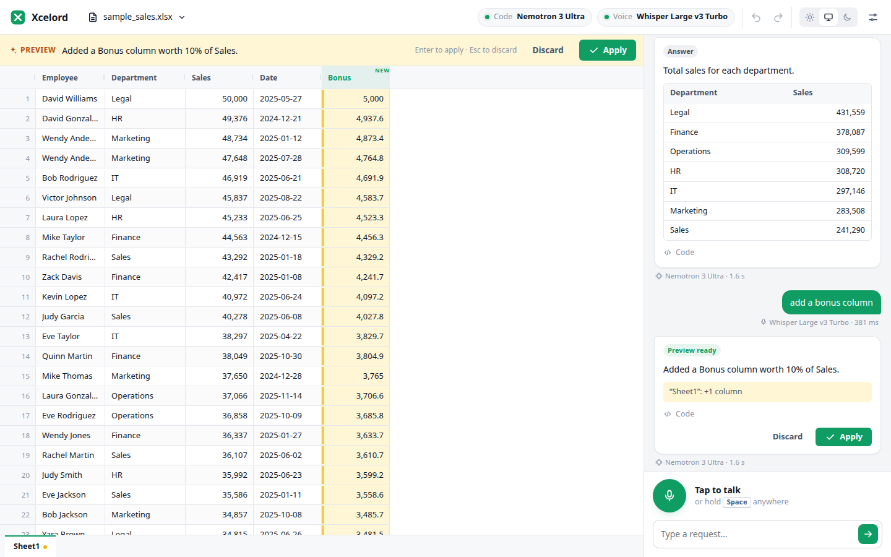
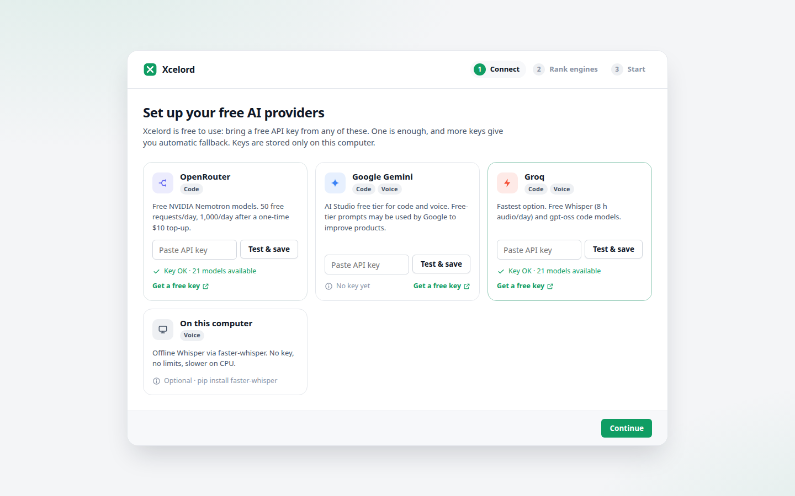
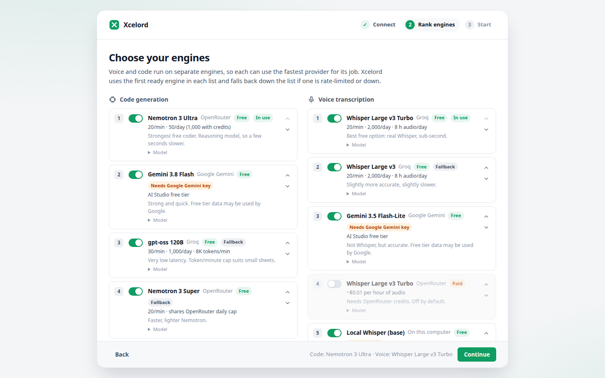
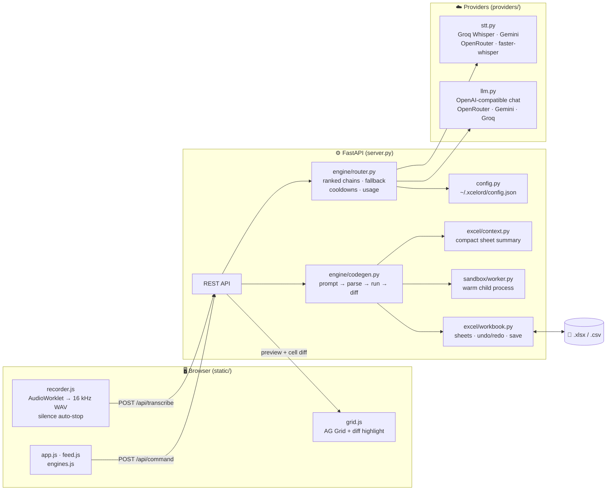
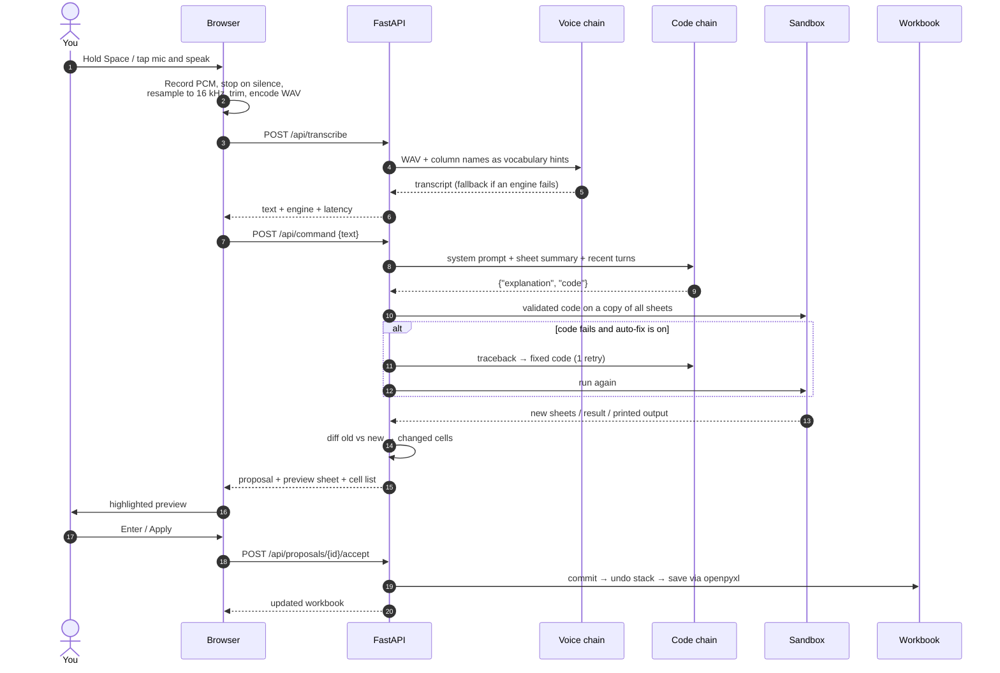

<div align="center">


# Xcelord

**Talk to your spreadsheets. Free.**

Say what you want done to an Excel sheet. Xcelord transcribes it, writes the pandas code, shows you a highlighted preview, and saves the change only when you apply it.

<p>
  
  
  
  
</p>

<p>
  <a href="#-quick-start">Quick start</a> ·
  <a href="#-engines">Engines</a> ·
  <a href="#-architecture">Architecture</a> ·
  <a href="#-api">API</a> ·
  <a href="#-development">Development</a>
</p>

<picture>
  <source media="(prefers-color-scheme: dark)" srcset="docs/screenshots/preview-dark.png">
  
</picture>

</div>

---

## ✨ Features

| | |
|---|---|
| 🎙️ **Voice or text** | Tap the mic or hold <kbd>Space</kbd> anywhere. Recording stops on its own when you pause. |
| 👀 **Preview before apply** | Changed cells are highlighted and new columns are tagged. Nothing is saved until you press <kbd>Enter</kbd> or click **Apply**. |
| 🆓 **Free to run** | Uses free tiers from OpenRouter (NVIDIA Nemotron), Google Gemini and Groq. Bring your own keys. |
| 🔀 **Two independent engine chains** | Voice and code use separate, ranked, toggleable provider lists with automatic fallback. |
| 🧾 **Keeps your workbook intact** | Saves through openpyxl: formatting, formulas in untouched cells and other sheets survive. |
| ↩️ **Undo / redo** | Up to 30 steps, covering both AI edits and manual cell edits. |
| 🛡️ **Guarded execution** | Generated code is checked against an allowlist and runs in a separate process with a timeout. |
| 🌗 **Light and dark** | Follows your system theme or can be set manually. Works on phone-width screens too. |

## 🚀 Quick start

Clone the repo and run one script. **Nothing else to install**: the script sets up Python and all dependencies by itself.

<table>
<tr><th width="50%">🐧 Linux / 🍎 macOS</th><th width="50%">🪟 Windows</th></tr>
<tr valign="top">
<td>

```bash
git clone https://github.com/HellThrall2000/Xcelord.git
cd Xcelord
./run.sh
```

</td>
<td>

```bat
git clone https://github.com/HellThrall2000/Xcelord.git
cd Xcelord
run.bat
```
You can also double-click `run.bat` in Explorer.

</td>
</tr>
</table>

Your browser opens at **http://127.0.0.1:8765** with a short setup screen:

1. **Connect:** paste a free key from any provider below and press **Test & save**. One key is enough.
2. **Rank engines:** keep the defaults or reorder them.
3. **Start:** open the sample workbook or your own file, then talk or type.

To start Xcelord again later, run the same script. It's ready in a second or two.

<details>
<summary><b>What the script does on first run (about a minute)</b></summary>
<br>

| Step | Details |
|---|---|
| 1. Find Python | Uses an installed Python 3.10+ if there is one. |
| 2. Otherwise fetch one | Downloads [uv](https://github.com/astral-sh/uv) and a private Python 3.12 into `.tools/` inside the repo. Nothing is installed system-wide and PATH isn't changed. |
| 3. Create `.venv` | A private environment inside the repo. If the system Python lacks pip (common on Debian/Ubuntu), pip is fetched automatically. |
| 4. Install dependencies | Runs only when `pyproject.toml` changes, so later starts skip it. |
| 5. Launch | Starts the server and opens your browser. <kbd>Ctrl</kbd>+<kbd>C</kbd> stops it. |

To uninstall, delete the repo folder, plus `~/.xcelord/` if you also want to remove saved keys.

</details>

<details>
<summary><b>Options, downloading as ZIP, requirements</b></summary>
<br>

| Option (works with both scripts) | Effect |
|---|---|
| `--local-whisper` | Also install offline Whisper ([faster-whisper](https://github.com/SYSTRAN/faster-whisper)) |
| `--port 9000` | Use a different port |
| `--no-browser` | Don't open a browser tab |
| `--reinstall` | Force a dependency reinstall |

- **Downloaded as ZIP instead of cloning?** Linux/macOS: run `bash run.sh`, because ZIP files drop the executable bit.
- **Requirements:** an internet connection on first run (plus `curl` or `wget` on Linux/macOS, which are almost always present), and a modern browser (Chrome, Edge, Firefox or Safari).

</details>

### Get a free key (you need at least one)

You paste the key into the setup screen; there are no config files to edit. You can change keys and engines anytime in **Settings**.

| Provider | Free key | Used for | Free allowance |
|---|---|---|---|
|  | [openrouter.ai/settings/keys](https://openrouter.ai/settings/keys) | Code | 20 req/min · 50/day (1,000/day after a one-time $10 credit purchase) |
|  | [aistudio.google.com/apikey](https://aistudio.google.com/apikey) | Code + voice | AI Studio free tier ⚠️ Google may use free-tier prompts to improve its products |
|  | [console.groq.com/keys](https://console.groq.com/keys) | Code + voice | Whisper: 2,000 req/day, 8 h audio/day · gpt-oss: 1,000 req/day |

<details>
<summary>📸 Setup screens</summary>
<br>

<picture>
  <source media="(prefers-color-scheme: dark)" srcset="docs/screenshots/setup-dark.png">
  
</picture>

<picture>
  <source media="(prefers-color-scheme: dark)" srcset="docs/screenshots/engines-dark.png">
  
</picture>

</details>

## 🔀 Engines

Transcription and code generation are **separate chains**. Each runs the first *ready* engine in its list, meaning enabled, with a key, and not cooling down. If that engine fails or is rate-limited, the chain falls through to the next one. An engine that returns HTTP 429 moves to the back of the line for its `Retry-After` period (30 s by default), so a known-limited provider doesn't add delay to every request.

Every engine can be **toggled, reordered, or pointed at another model ID** from the setup screen or Settings.

<table>
<tr><th width="50%">🧠 Code generation (best first)</th><th width="50%">🎙️ Voice transcription (best first)</th></tr>
<tr valign="top"><td>

| # | Engine | Via |
|---|---|---|
| 1 | Nemotron 3 Ultra | OpenRouter |
| 2 | Gemini 3.8 Flash | Gemini |
| 3 | gpt-oss 120B | Groq |
| 4 | Nemotron 3 Super | OpenRouter |
| 5 | Gemini 3.5 Flash-Lite | Gemini |
| 6 | gpt-oss 20B | Groq |

</td><td>

| # | Engine | Via |
|---|---|---|
| 1 | Whisper Large v3 Turbo | Groq |
| 2 | Whisper Large v3 | Groq |
| 3 | Gemini 3.5 Flash-Lite | Gemini |
| 4 | Whisper Large v3 Turbo 💲 | OpenRouter *(off by default, about $0.01/h of audio)* |
| 5 | Local Whisper `base` | This computer *(offline)* |

</td></tr>
</table>

The catalog lives in [`xcelord/catalog.py`](xcelord/catalog.py). Adding an engine there means adding one `Engine(...)` entry.

## 🧱 Architecture

Xcelord is a local web app: a **FastAPI** backend serves a **no-build ES-module frontend** and brokers every call to AI providers. Nothing runs in the cloud except the model calls you configure.



### Lifecycle of a voice command



### Design decisions

| Decision | Why |
|---|---|
| **Separate voice and code endpoints** | The transcript comes back as soon as speech-to-text finishes. A slow or rate-limited code engine never delays it, and each side can use a different provider. |
| **Preview, then commit** | Code runs on a *copy*. `codegen.py` stores a pending proposal; only `accept` writes to disk. A version counter rejects stale previews if the workbook changed in between. |
| **Compact context** | The model sees column types, value ranges, category values and 5 sample rows, never the whole sheet. That keeps prompts small, fast and within Groq's 8K tokens/min free cap. |
| **Structured replies** | The model returns `{"explanation", "code"}`. The parser tolerates `<think>` blocks, code fences and extra prose, so reasoning models like Nemotron work unchanged. |
| **One HTTP client** | A pooled keep-alive `httpx.Client` means TLS handshakes are paid once per provider, not per request. |
| **Warm sandbox** | A persistent `spawn`ed worker imports pandas once. Commands avoid a 0.5 to 1 s cold start; on timeout the worker is killed and respawned. |
| **Format-preserving saves** | If a sheet's shape is unchanged, only the edited cells are written. Otherwise the sheet's values are rewritten while styles, other sheets and VBA (`.xlsm`) are kept. Writes are atomic (temp file + `os.replace`). |
| **Browser-side audio** | The mic belongs to whoever uses the browser, not the server machine. 16 kHz mono WAV is accepted by every speech-to-text provider without ffmpeg. |
| **No build step** | Plain HTML/CSS/ES modules: no Node toolchain for users or contributors. AG Grid Community loads from jsDelivr. |

### Safety model

Generated code passes two layers:

1. **Static check** ([`sandbox/validator.py`](xcelord/sandbox/validator.py)). Imports are limited to `pandas, numpy, math, datetime, re, statistics, …`. `open`, `eval`, `exec`, `getattr`, `__import__` and private/dunder attributes are rejected, as is any pandas/numpy I/O (`read_*`, `to_csv`, `to_excel`, `np.load`, …).
2. **Runtime** ([`sandbox/worker.py`](xcelord/sandbox/worker.py)). The code runs in a separate process with filtered builtins and an import hook, in an empty temp directory, with a 20 s timeout.

> [!IMPORTANT]
> This guards against *model mistakes*. It is not a security boundary against a hostile user. Xcelord is designed to run locally, for yourself; don't expose it on a public network.

## 📁 Project structure

```text
Xcelord/
├── run.sh / run.bat          One-command launchers (find Python 3.10+, hand off to launch.py)
├── scripts/launch.py         Creates .venv, installs when pyproject changes, starts the app
├── pyproject.toml            Package metadata, dependencies, `xcelord` entry point
├── xcelord/
│   ├── __main__.py           CLI: --host --port --no-browser --reload
│   ├── server.py             FastAPI routes + static file serving
│   ├── catalog.py            Providers and ranked engine lists (edit here to add models)
│   ├── config.py             Settings store, key lookup (env vars override saved keys)
│   ├── providers/
│   │   ├── http.py           Shared client, ProviderError, error normalisation
│   │   ├── llm.py            Chat completions + key tests
│   │   └── stt.py            Groq / OpenRouter / Gemini / local faster-whisper
│   ├── engine/
│   │   ├── router.py         Chain runner: fallback, 429 cooldowns, daily usage
│   │   ├── prompts.py        System prompt, user and repair messages
│   │   └── codegen.py        Request → code → sandbox → diff → proposal
│   ├── excel/
│   │   ├── workbook.py       Load / diff / save / undo / cell edits
│   │   └── context.py        Sheet summary and speech vocabulary
│   ├── sandbox/
│   │   ├── validator.py      AST allowlist checks
│   │   └── worker.py         Warm execution process with timeout
│   ├── samples/              sample_sales.xlsx
│   └── static/               index.html · css/app.css · js/{app,api,grid,feed,engines,recorder,theme,dom}.js
├── tests/                    pytest suite (sandbox, workbook, API, fallback, error parsing)
└── docs/                     Logo and screenshots
```

## 🔐 Configuration and data

| What | Where |
|---|---|
| API keys and settings | `~/.xcelord/config.json` (file mode `600`, **outside the repo**, so it never reaches git) |
| Daily request counts | `~/.xcelord/usage.json` |
| Uploaded files and sample copies | `~/.xcelord/workspace/` |
| Override the folder | `XCELORD_HOME=/some/path` |
| Keys from the environment | `OPENROUTER_API_KEY`, `GEMINI_API_KEY`, `GROQ_API_KEY` (take precedence over saved keys) |

**Open file on this computer** edits the file *in place*: applied changes are saved straight back to it. Uploads and the sample are edited as copies in the workspace folder; use **Download** to get them back.

## ⌨️ Shortcuts

| Key | Action |
|---|---|
| Hold <kbd>Space</kbd> | Push-to-talk (when not typing) |
| <kbd>Enter</kbd> | Apply the preview · send the typed request |
| <kbd>Esc</kbd> | Discard the preview · cancel recording · close Settings |
| <kbd>Ctrl</kbd>+<kbd>Z</kbd> / <kbd>Ctrl</kbd>+<kbd>Shift</kbd>+<kbd>Z</kbd> | Undo / redo |
| <kbd>Shift</kbd>+<kbd>Enter</kbd> | New line in the request box |

## 🔌 API

All endpoints are JSON unless noted. Interactive docs are at `http://127.0.0.1:8765/docs`.

| Method | Path | Purpose |
|---|---|---|
| `GET` | `/api/meta` | Providers, engine catalog, local Whisper availability |
| `GET` · `PUT` | `/api/settings` | Read (keys masked) / patch settings, keys, engine order |
| `POST` | `/api/providers/{id}/test` | Validate a key without using model quota |
| `POST` | `/api/transcribe` | *multipart* `audio` (WAV) → `{text, engine, ms, attempts}` |
| `POST` | `/api/command` | `{text}` → `answer` · `proposal` (with preview + cells) · `clarify` · `error` |
| `POST` | `/api/proposals/{id}/accept` · `/reject` | Commit or drop a preview |
| `GET` | `/api/workbook` | Current workbook, sheets, active sheet data |
| `POST` | `/api/workbook/upload` · `/open` · `/sample` | Open an uploaded file, a local path, or the sample |
| `PUT` | `/api/workbook/active` | Switch sheet |
| `POST` | `/api/workbook/cell` | Manual cell edit (type-coerced, undoable) |
| `POST` | `/api/workbook/undo` · `/redo` | History |
| `GET` | `/api/workbook/download` | Download the current file |

## 🧰 Tech stack

<p align="center">
  <a href="https://skillicons.dev"></a>
</p>

<p align="center">
  
  
  
  
  
  
  <br>
  
  
  
  
  
</p>

| Layer | Choice |
|---|---|
| Backend | Python 3.10+, FastAPI, Uvicorn, HTTPX |
| Data | pandas (transformations), openpyxl (format-preserving read/write) |
| Frontend | Vanilla ES modules, CSS custom-property theming, AG Grid Community |
| Audio | Web Audio `AudioWorklet`, `OfflineAudioContext` resampling, WAV encoding in-browser |
| AI | OpenAI-compatible chat APIs (OpenRouter, Gemini, Groq); Whisper via Groq/OpenRouter or faster-whisper |
| Tests | pytest + FastAPI `TestClient`, providers mocked |

## 🔧 Development

```bash
./run.sh --no-browser             # or: source .venv/bin/activate
pip install -e ".[dev]"           # adds pytest
pytest                            # 38 tests, no network or API keys needed
xcelord --reload --no-browser     # auto-reload on code changes
```

<details>
<summary><b>Add a new model or provider</b></summary>

- **New model on an existing provider:** add an `Engine(...)` to `CODE_ENGINES` or `VOICE_ENGINES` in [`catalog.py`](xcelord/catalog.py). Saved settings pick it up automatically, appended to the end of the user's list.
- **New OpenAI-compatible provider:** add a `Provider(...)` with its `base_url` and `env_var`. `llm.chat` works unchanged.
- **New speech-to-text API:** add a branch in [`providers/stt.py`](xcelord/providers/stt.py) that takes WAV bytes and returns text.

</details>

<details>
<summary><b>Troubleshooting</b></summary>

| Problem | Fix |
|---|---|
| "Microphone access was blocked" | Allow the mic in the browser's address bar. Browsers only allow the mic on `localhost`/HTTPS. |
| "No code engine is ready" | Add a key in **Settings → Providers**, and make sure at least one engine for it is switched on. |
| "Couldn't save: the file is locked" | The workbook is open in Excel (Windows locks it). Close it there and apply again. |
| Everything is rate-limited | Free daily caps reset at midnight UTC. Add keys for other providers to spread the load. |
| `ensurepip is not available` | Handled automatically by the launcher, which downloads pip into `.venv`. |
| Grid doesn't appear | The grid loads from cdn.jsdelivr.net; check your internet connection. |

</details>

## 📄 License

[CC BY-NC-SA 4.0](LICENSE): free to use, share and adapt **non-commercially**, with attribution, under the same license.
